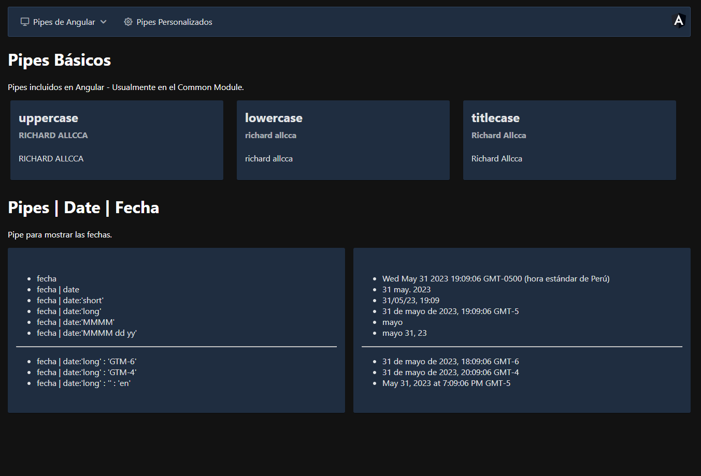
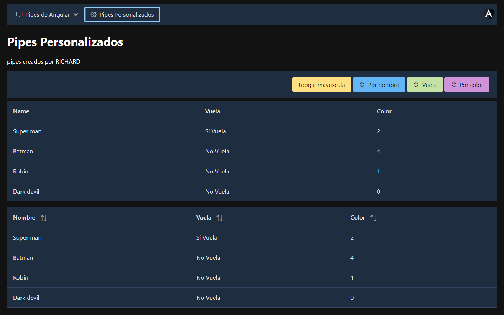

# PipesApp

- This project was generated with [Angular CLI](https://github.com/angular/angular-cli) version 14.0.2.

Componentes estilizados con `Prime Ng`

Correr en local si tienes cli 14.0.2 de forma global en tu equipo

    ng serve

Correr en local si la versión de tu cli es diferente a la 14.0.2

    npm install -D @angular/cli
    npm run start

## Notas

Common module

- Para usar los pipes en angular necesitas importar el modulo "commonModule"

## Instalación - Prime Ng

  1. Instalar los siguientes modulos:

          npm install primeng --save
          npm install primeicons --save

  2. Styles Prime NG, se deben agregar los siguientes módulos en angular.json en "styles" (selecciona un tema de Prime Ng)

          node_modules/primeicons/primeicons.css
          node_modules/primeng/resources/themes/vela-blue/theme.css
          node_modules/primeng/resources/primeng.min.css

  3. Puedes usar las variables de "css" disponibles en "root" luego del paso anterior de intalación

## Configuración de Animaciones Prime Ng

  1. Busca en la doc. el apartado `StackBlitz` que es un vscode incrustado.
  2. Copia del archivo `app-module` la inportación de `BrowseranimationModule`

## Configuración de Pipe Fecha (app.module)

De la misma forma tienes que registrar el idioma que necesties usar

    import localeEsPeru from "@angular/common/locales/es-PE";
    import { registerLocaleData } from '@angular/common'
    registerLocaleData(localeEsPeru);

implementación global (app.module)

    providers: [
      {
         provide: LOCALE_ID, useValue: 'es-PE'
      }
    ],

## Enlaces

- [Api List](https://angular.io/api?query=pipe)
- [Prime NG](https://www.primefaces.org/primeng/)
- [Iconos Prime Ng](https://www.primefaces.org/primeng/icons)
- [Prime Flex](https://www.primefaces.org/primeflex/setup)
- [Date Pipe](https://www.primefaces.org/primeng/card)
- [Async Pipe](https://angular.io/api/common/AsyncPipe)
- [Prime Toolbar](https://primefaces.org/primeng/toolbar)

## Banderas para comandos `CLI`

`--flat` evita crear una carpeta appRoter
`--skip-tests` evita crear un archivo para test
`-is` evita crear una hoja estilos al crear un componente

## Pipes en este proyecto

Uppercase

Lowercase

TitleCase

Date

Decimal

Currency

Percent

i18nSelect

i18Plural

KeyValue

Json

Async

## Vista previa

## Vista del flujo de archivos

