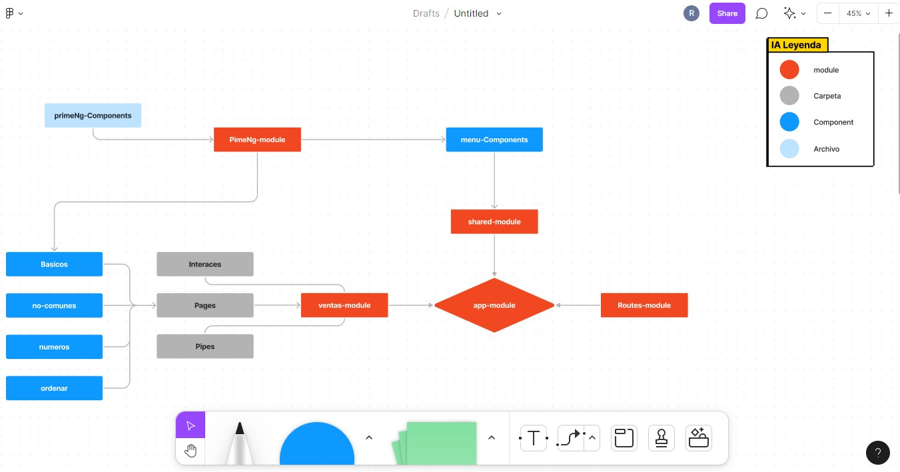

# PipesApp

This project was generated with [Angular CLI](https://github.com/angular/angular-cli) version 14.0.2.

## Nota de Common module

- PIPES para usar pipes en angular debes importar el paquete "common"

## Nota de Instalación - Prime Ng

1. Instalar los siguientes modulos:

         npm install primeng --save
         npm install primeicons --save

2. Styles Prime NG, se deben agregar los siguientes módulos en angular.json en "styles" (selecciona un theme de Prime Ng)

         node_modules/primeicons/primeicons.css
         node_modules/primeng/resources/themes/vela-blue/theme.css
         node_modules/primeng/resources/primeng.min.css

3. Puedes usar las variables de "css" disponibles en "root" luego del paso anterior de intalación

## Configuración de Animaciones Prime Ng
  
1. Animaciones de `PrimerNg`, busca en la doc. el apartado `StackBlitz` que es un vscode y copia del `app-module` la inportación de `BrowseranimationModule`

## Enlaces

- [Api List](https://angular.io/api?query=pipe)
- [Prime NG](https://www.primefaces.org/primeng/)
- [Iconos Prime Ng](https://www.primefaces.org/primeng/icons)
- [Prime Flex](https://www.primefaces.org/primeflex/setup)
- [Date Pipe](https://www.primefaces.org/primeng/card)
- [Async Pipe](https://angular.io/api/common/AsyncPipe)

## Banderas para comandos `CLI`

`--flat` evita crear una carpeta appRoter
`--skip-tests` evita crear un archivo para test
`-is` evita crear una hoja estilos al crear un componente

## Rutas

1. Crear si no tienes el `app-router.module.ts`
2. Crear los `path` de las rutas validas.
3. Exportar el `RouterModule` desde `app-router.module`
4. Importar en el `app.module.ts` en el `app.module.ts`

## Vista del flujo de archivos

